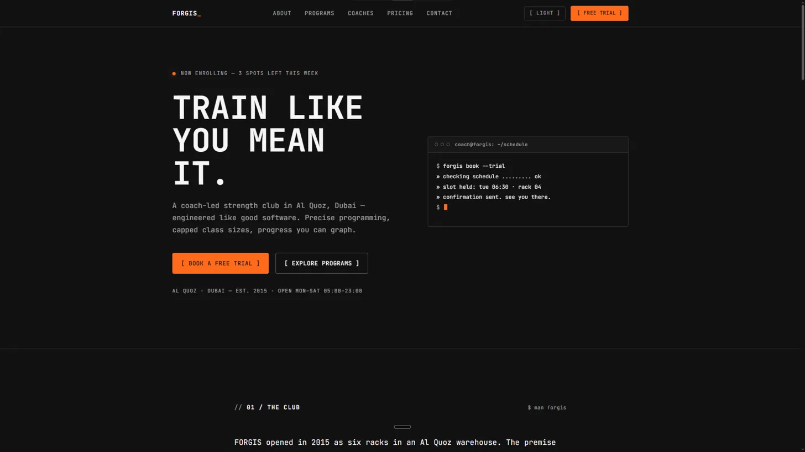
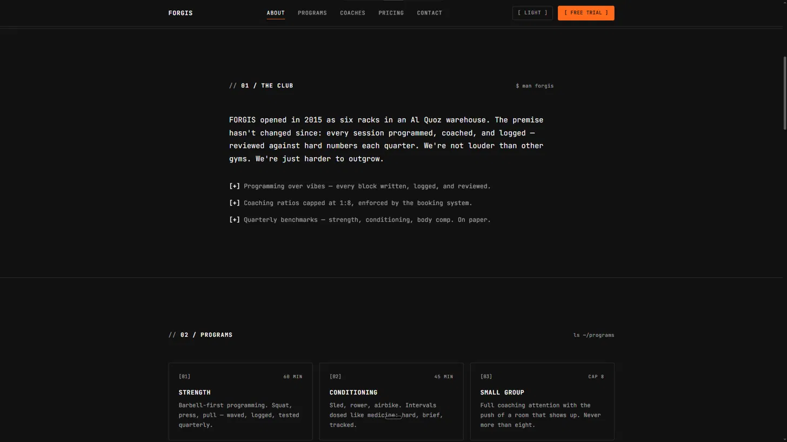
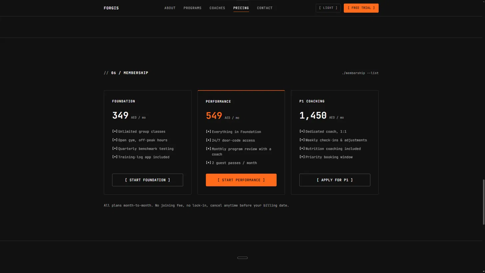
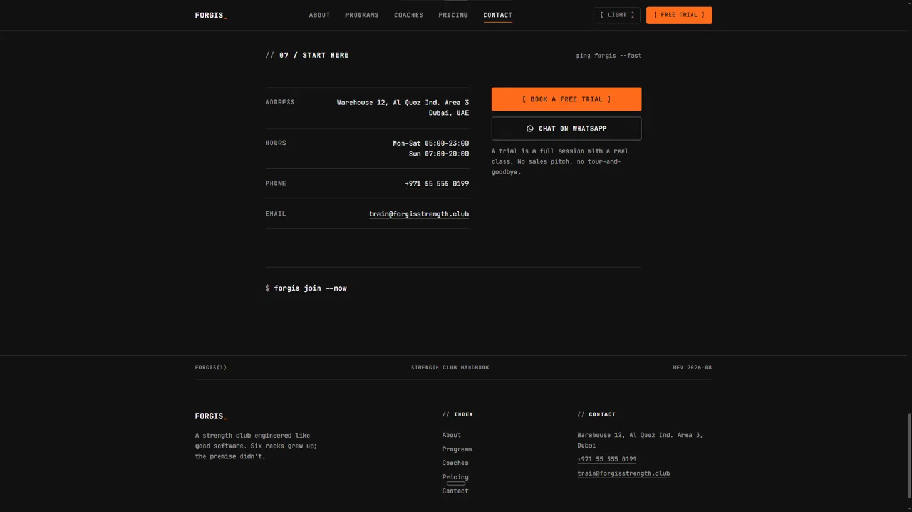

# FORGIS — Strength Club, Dubai

A landing page concept for a coach-led strength and conditioning club in Al Quoz, Dubai — built around the idea that good training, like good software, comes down to precise programming.

🔗 **Live:** https://project-forgis.akshaycodecrafter.workers.dev/

## Preview


*Hero with the "TRAIN LIKE YOU MEAN IT." headline, subtitle, and a live terminal-style demo of the free-trial booking flow.*


*The Club intro and the start of the Programs grid — Strength, Conditioning, and Small Group cards side-by-side.*


*The Membership tier grid — Foundation (349 AED/mo), Performance (549 AED/mo), and P1 Coaching (1,450 AED/mo).*


*The Start Here contact block — Al Quoz warehouse address, hours, phone, and direct email, paired with the WhatsApp chat action and the closing CLI prompt.*

## About

I wanted to try something with this one: what if a gym site was written the way a well-run engineering team talks about their work? Not "transform your body," but "precise programming, capped class ratios, measurable results." FORGIS is that experiment — a strength club site that treats training like a system you can actually reason about, not a mood board.

## What's on the page

- **Hero** — "Train like you mean it," with a first-trial CTA
- **Programs** — six offerings: Strength, Conditioning, Small Group, Personal Training, Mobility & Recovery, Nutrition
- **Coaches** — four coach profiles (Dana Al-Madani, Marcus Webb, Priya Nair, Tomasz Kowalski)
- **Pricing** — three tiers: Foundation, Performance, P1 Coaching
- **Contact** — club details, hours, and direct contact info for Al Quoz, Dubai

## Built with


- HTML5, CSS3, JavaScript (vanilla)
- Custom SVG favicon matching the site's accent color and monospace wordmark style
- Fully responsive layout

## Why I built it this way

Every strength-club site I looked at while researching this used almost the same three words — "transform," "grind," "results." I wanted FORGIS to sound like it was written by someone who actually programs the sessions, not someone writing ad copy for one. Hence the very direct, almost technical tone throughout — "capped class ratios," "quarterly benchmarks" — language that treats the member like someone who wants to see the numbers, not just hear a promise.

## Running it locally

It's a self-contained static site split into:
```
forgis/
├── index.html
├── css/style.css
├── js/script.js
└── assets/favicon.svg
```
Just clone and open `index.html` in a browser — no build step, no dependencies to install.

## Status

This is a demo/concept build — the club, coaches, and contact details are illustrative, not a live business.
